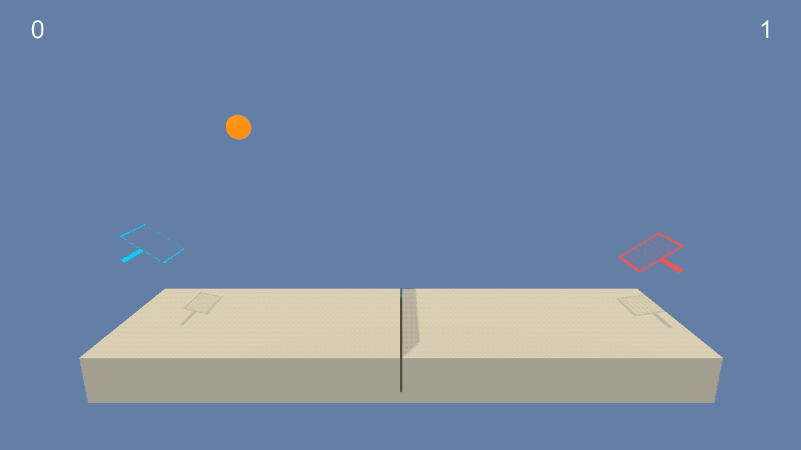

# Collaboration and Competition

## Project details

This project contains a solution to the third project of Udacity Deep Reinforcement Learning.

In this environment, two agents control rackets to bounce a ball over a net. If an agent hits the ball over the net, it receives a reward of +0.1. If an agent lets a ball hit the ground or hits the ball out of bounds, it receives a reward of -0.01. Thus, the goal of each agent is to keep the ball in play.

The observation space consists of 8 variables corresponding to the position and velocity of the ball and racket. Each agent receives its own, local observation. Two continuous actions are available, corresponding to movement toward (or away from) the net, and jumping.

The task is episodic, and in order to solve the environment, your agents must get an average score of +0.5 (over 100 consecutive episodes, after taking the maximum over both agents). Specifically,

After each episode, we add up the rewards that each agent received (without discounting), to get a score for each agent. This yields 2 (potentially different) scores. We then take the maximum of these 2 scores.
This yields a single score for each episode.
The environment is considered solved, when the average (over 100 episodes) of those scores is at least +0.5.

It is helpful to check the repository below for details.
* https://github.com/udacity/deep-reinforcement-learning/tree/master/p3_collab-compet

## Getting started
### Prerequired
* Python 3.6
* Unity

And then to install python dependencies. 

    pip install -r requirements.txt

Then you should be able to run `jupyter notebook` and view `Tennis.ipynb`. 

The code for the Model and Agent are in `model.py` and `ddpg_agent.py`, respectively.

## Instructions

Run each cell of `Tennis.ipynb`.

You can also run `run.py` to pop up the Unity Agent directly and check the behavior with the already trained weight.

    python run.py