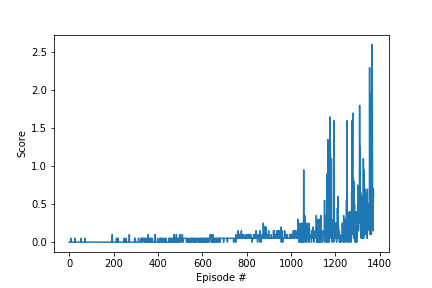

# Learning Algorithm

DDPG algorithm and implemented code for implementing Multi Agent based on the DDPG pendulum implementation of Udacity's deep-reinforcement-learning.

This model is composed of two networks of Actor Critic type because Continous Action Space is supposed to generate high variance.

Actor network takes an observation of the Unity Agent as an input and outputs an action.
Critic network is used to compute advantage for state value estimation.

# Model Architectures and Hyperparameters

Actor passes the input it passes with no preprocessing and outputs 2 values that are the size of the action space.
Critic is using compute advantages state value.

Hyperparameters were adjusted based on Udacity deep-reinforcement-learning's DDPG Pendulum (https://github.com/deep-reinforcement-learning/ddpg-pendulum) until the score got better.

The layers and hyperparameters used are shown below.

## Actor

- 3 Fully connected layer
    - Fully connected layer - input: 24 (state size) output: 400
    - Fully connected layer - input: 400 output 300
    - Fully connected layer - input: 300 output: (action size -> 2)
    - Each fully connected layer is activated by ReLU and The last one is tanh for make fitting -1~1

## Critic

- 3 Fully connected layer
    - Fully connected layer - input: 33 (state size) output: 400
    - Fully connected layer - input: 400+4 output 300
    - Fully connected layer - input: 300 output: 1
    - Each fully connected layer is activated by ReLU and The last one does not activate.
    
## Hyperparameters
The all hyperparameters are specified in config.py and ddpg_agent.

- Mini batch size = 1024
- Tau = 0.001
- Gamma = 0.99
- Learning rate of actor = 1e-4
- Learning rate of critic = 1e-3
- Weight decay = 0
- Epsilon minimum = 0.1
- Epsilon maximum = 1.0

# Tuning Hyper parameter

I was able to hold a mini batch size at 128 in the beginning, during the 100 episodes, an average of 0.5 was reached, which was close to reaching 3,000 episodes.
I think it would be better to have a longer Observation time in a continuous environment.

I think it would be better to have a longer Observation time in a continuous environment. 
I increased it to 1024 and I was able to get my desired score with less than 1400 episodes.
 
# Plot of Rewards



```
Episode 10 Average score: 0.00 Min: -0.00 Max: 0.05 Time: 0.04 Epsilon: 1.00
Episode 20 Average score: -0.00 Min: -0.00 Max: 0.05 Time: 0.07 Epsilon: 1.00
Episode 30 Average score: 0.00 Min: -0.00 Max: 0.05 Time: 0.17 Epsilon: 1.00
Episode 40 Average score: -0.00 Min: -0.00 Max: 0.05 Time: 0.18 Epsilon: 1.00
Episode 50 Average score: -0.00 Min: -0.00 Max: 0.05 Time: 0.17 Epsilon: 1.00
Episode 60 Average score: -0.00 Min: -0.00 Max: 0.05 Time: 0.18 Epsilon: 1.00
Episode 70 Average score: -0.00 Min: -0.00 Max: 0.05 Time: 0.18 Epsilon: 1.00
Episode 80 Average score: -0.00 Min: -0.00 Max: 0.05 Time: 0.20 Epsilon: 1.00
Episode 90 Average score: -0.00 Min: -0.00 Max: 0.05 Time: 0.33 Epsilon: 1.00
Episode 100 Average score: -0.00 Min: -0.00 Max: 0.05 Time: 0.18 Epsilon: 1.00
Episode 110 Average score: -0.00 Min: -0.00 Max: 0.05 Time: 0.33 Epsilon: 1.00
Episode 120 Average score: -0.00 Min: -0.00 Max: 0.05 Time: 0.33 Epsilon: 1.00
Episode 130 Average score: -0.00 Min: -0.00 Max: 0.05 Time: 0.18 Epsilon: 1.00
Episode 140 Average score: -0.00 Min: -0.00 Max: 0.05 Time: 0.34 Epsilon: 1.00
Episode 150 Average score: -0.00 Min: -0.00 Max: 0.05 Time: 0.35 Epsilon: 1.00
Episode 160 Average score: -0.00 Min: -0.00 Max: 0.05 Time: 0.34 Epsilon: 1.00
Episode 170 Average score: -0.00 Min: -0.00 Max: 0.05 Time: 0.40 Epsilon: 1.00
Episode 180 Average score: -0.00 Min: -0.00 Max: 0.05 Time: 0.18 Epsilon: 1.00
Episode 190 Average score: -0.00 Min: -0.00 Max: 0.05 Time: 0.19 Epsilon: 1.00
Episode 200 Average score: -0.00 Min: -0.00 Max: 0.10 Time: 0.18 Epsilon: 1.00
Episode 210 Average score: -0.00 Min: -0.00 Max: 0.10 Time: 0.33 Epsilon: 1.00
Episode 220 Average score: -0.00 Min: -0.00 Max: 0.10 Time: 0.34 Epsilon: 1.00
Episode 230 Average score: -0.00 Min: -0.00 Max: 0.10 Time: 0.36 Epsilon: 1.00
Episode 240 Average score: -0.00 Min: -0.00 Max: 0.10 Time: 0.18 Epsilon: 1.00
Episode 250 Average score: 0.00 Min: -0.00 Max: 0.10 Time: 0.34 Epsilon: 1.00
Episode 260 Average score: 0.00 Min: -0.00 Max: 0.10 Time: 0.18 Epsilon: 1.00
Episode 270 Average score: 0.00 Min: -0.00 Max: 0.10 Time: 0.19 Epsilon: 1.00
Episode 280 Average score: 0.00 Min: -0.00 Max: 0.10 Time: 0.70 Epsilon: 1.00
Episode 290 Average score: 0.00 Min: -0.00 Max: 0.10 Time: 0.37 Epsilon: 1.00
Episode 300 Average score: 0.00 Min: -0.00 Max: 0.10 Time: 0.19 Epsilon: 1.00
Episode 310 Average score: 0.00 Min: -0.00 Max: 0.10 Time: 0.34 Epsilon: 1.00
Episode 320 Average score: 0.00 Min: -0.00 Max: 0.10 Time: 0.34 Epsilon: 1.00
Episode 330 Average score: 0.00 Min: -0.00 Max: 0.10 Time: 0.35 Epsilon: 1.00
Episode 340 Average score: 0.00 Min: -0.00 Max: 0.10 Time: 0.35 Epsilon: 1.00
Episode 350 Average score: 0.01 Min: -0.00 Max: 0.10 Time: 0.35 Epsilon: 1.00
Episode 360 Average score: 0.01 Min: -0.00 Max: 0.10 Time: 0.54 Epsilon: 1.00
Episode 370 Average score: 0.01 Min: -0.00 Max: 0.10 Time: 0.19 Epsilon: 1.00
Episode 380 Average score: 0.01 Min: -0.00 Max: 0.10 Time: 0.19 Epsilon: 1.00
Episode 390 Average score: 0.01 Min: -0.00 Max: 0.10 Time: 0.34 Epsilon: 1.00
Episode 400 Average score: 0.01 Min: -0.00 Max: 0.10 Time: 0.52 Epsilon: 1.00
Episode 410 Average score: 0.01 Min: -0.00 Max: 0.10 Time: 0.53 Epsilon: 1.00
Episode 420 Average score: 0.01 Min: -0.00 Max: 0.10 Time: 0.53 Epsilon: 1.00
Episode 430 Average score: 0.01 Min: -0.00 Max: 0.10 Time: 0.33 Epsilon: 1.00
Episode 440 Average score: 0.01 Min: -0.00 Max: 0.10 Time: 0.34 Epsilon: 1.00
Episode 450 Average score: 0.01 Min: -0.00 Max: 0.10 Time: 0.34 Epsilon: 1.00
Episode 460 Average score: 0.01 Min: -0.00 Max: 0.10 Time: 0.54 Epsilon: 1.00
Episode 470 Average score: 0.01 Min: -0.00 Max: 0.10 Time: 0.52 Epsilon: 1.00
Episode 480 Average score: 0.01 Min: -0.00 Max: 0.10 Time: 0.38 Epsilon: 1.00
Episode 490 Average score: 0.01 Min: -0.00 Max: 0.10 Time: 0.34 Epsilon: 1.00
Episode 500 Average score: 0.01 Min: -0.00 Max: 0.10 Time: 0.71 Epsilon: 1.00
Episode 510 Average score: 0.02 Min: -0.00 Max: 0.10 Time: 0.37 Epsilon: 1.00
Episode 520 Average score: 0.02 Min: -0.00 Max: 0.10 Time: 0.53 Epsilon: 1.00
Episode 530 Average score: 0.02 Min: -0.00 Max: 0.10 Time: 0.20 Epsilon: 1.00
Episode 540 Average score: 0.02 Min: -0.00 Max: 0.10 Time: 0.19 Epsilon: 1.00
Episode 550 Average score: 0.02 Min: -0.00 Max: 0.10 Time: 0.34 Epsilon: 1.00
Episode 560 Average score: 0.02 Min: -0.00 Max: 0.10 Time: 0.55 Epsilon: 1.00
Episode 570 Average score: 0.02 Min: -0.00 Max: 0.10 Time: 0.18 Epsilon: 1.00
Episode 580 Average score: 0.02 Min: -0.00 Max: 0.10 Time: 0.52 Epsilon: 1.00
Episode 590 Average score: 0.03 Min: -0.00 Max: 0.10 Time: 0.35 Epsilon: 1.00
Episode 600 Average score: 0.02 Min: -0.00 Max: 0.10 Time: 0.20 Epsilon: 1.00
Episode 610 Average score: 0.02 Min: -0.00 Max: 0.10 Time: 0.54 Epsilon: 1.00
Episode 620 Average score: 0.02 Min: -0.00 Max: 0.10 Time: 0.19 Epsilon: 1.00
Episode 630 Average score: 0.02 Min: -0.00 Max: 0.10 Time: 0.19 Epsilon: 1.00
Episode 640 Average score: 0.02 Min: -0.00 Max: 0.10 Time: 0.73 Epsilon: 1.00
Episode 650 Average score: 0.02 Min: -0.00 Max: 0.10 Time: 0.72 Epsilon: 1.00
Episode 660 Average score: 0.02 Min: -0.00 Max: 0.10 Time: 0.53 Epsilon: 1.00
Episode 670 Average score: 0.02 Min: -0.00 Max: 0.10 Time: 0.56 Epsilon: 1.00
Episode 680 Average score: 0.02 Min: -0.00 Max: 0.10 Time: 0.54 Epsilon: 1.00
Episode 690 Average score: 0.03 Min: -0.00 Max: 0.10 Time: 0.37 Epsilon: 1.00
Episode 700 Average score: 0.03 Min: -0.00 Max: 0.10 Time: 0.54 Epsilon: 1.00
Episode 710 Average score: 0.03 Min: -0.00 Max: 0.10 Time: 0.55 Epsilon: 1.00
Episode 720 Average score: 0.03 Min: -0.00 Max: 0.10 Time: 0.69 Epsilon: 1.00
Episode 730 Average score: 0.04 Min: -0.00 Max: 0.10 Time: 0.55 Epsilon: 1.00
Episode 740 Average score: 0.04 Min: -0.00 Max: 0.10 Time: 0.55 Epsilon: 1.00
Episode 750 Average score: 0.04 Min: -0.00 Max: 0.10 Time: 0.54 Epsilon: 1.00
Episode 760 Average score: 0.04 Min: -0.00 Max: 0.10 Time: 0.56 Epsilon: 1.00
Episode 770 Average score: 0.04 Min: -0.00 Max: 0.15 Time: 1.11 Epsilon: 1.00
Episode 780 Average score: 0.05 Min: -0.00 Max: 0.15 Time: 1.07 Epsilon: 1.00
Episode 790 Average score: 0.05 Min: -0.00 Max: 0.15 Time: 0.94 Epsilon: 1.00
Episode 800 Average score: 0.05 Min: -0.00 Max: 0.15 Time: 0.55 Epsilon: 1.00
Episode 810 Average score: 0.05 Min: -0.00 Max: 0.15 Time: 0.55 Epsilon: 1.00
Episode 820 Average score: 0.05 Min: -0.00 Max: 0.15 Time: 0.59 Epsilon: 1.00
Episode 830 Average score: 0.05 Min: -0.00 Max: 0.15 Time: 0.54 Epsilon: 1.00
Episode 840 Average score: 0.06 Min: -0.00 Max: 0.15 Time: 0.74 Epsilon: 1.00
Episode 850 Average score: 0.06 Min: -0.00 Max: 0.15 Time: 0.37 Epsilon: 1.00
Episode 860 Average score: 0.06 Min: -0.00 Max: 0.15 Time: 1.33 Epsilon: 1.00
Episode 870 Average score: 0.06 Min: -0.00 Max: 0.15 Time: 1.01 Epsilon: 1.00
Episode 880 Average score: 0.06 Min: -0.00 Max: 0.25 Time: 2.02 Epsilon: 1.00
Episode 890 Average score: 0.06 Min: -0.00 Max: 0.25 Time: 0.55 Epsilon: 1.00
Episode 900 Average score: 0.06 Min: -0.00 Max: 0.25 Time: 1.11 Epsilon: 1.00
Episode 910 Average score: 0.06 Min: -0.00 Max: 0.25 Time: 0.71 Epsilon: 1.00
Episode 920 Average score: 0.06 Min: -0.00 Max: 0.25 Time: 0.58 Epsilon: 1.00
Episode 930 Average score: 0.06 Min: -0.00 Max: 0.25 Time: 0.92 Epsilon: 1.00
Episode 940 Average score: 0.06 Min: -0.00 Max: 0.25 Time: 0.91 Epsilon: 1.00
Episode 950 Average score: 0.07 Min: -0.00 Max: 0.25 Time: 0.56 Epsilon: 1.00
Episode 960 Average score: 0.07 Min: -0.00 Max: 0.25 Time: 0.74 Epsilon: 1.00
Episode 970 Average score: 0.07 Min: -0.00 Max: 0.25 Time: 0.56 Epsilon: 1.00
Episode 980 Average score: 0.07 Min: -0.00 Max: 0.25 Time: 1.08 Epsilon: 1.00
Episode 990 Average score: 0.06 Min: -0.00 Max: 0.25 Time: 0.72 Epsilon: 1.00
Episode 1000 Average score: 0.06 Min: -0.00 Max: 0.25 Time: 0.58 Epsilon: 1.00
Episode 1010 Average score: 0.07 Min: -0.00 Max: 0.25 Time: 0.56 Epsilon: 1.00
Episode 1020 Average score: 0.07 Min: -0.00 Max: 0.25 Time: 0.92 Epsilon: 1.00
Episode 1030 Average score: 0.07 Min: -0.00 Max: 0.25 Time: 0.57 Epsilon: 1.00
Episode 1040 Average score: 0.07 Min: -0.00 Max: 0.30 Time: 0.55 Epsilon: 1.00
Episode 1050 Average score: 0.08 Min: -0.00 Max: 0.30 Time: 1.28 Epsilon: 1.00
Episode 1060 Average score: 0.09 Min: -0.00 Max: 0.95 Time: 0.56 Epsilon: 1.00
Episode 1070 Average score: 0.09 Min: -0.00 Max: 0.95 Time: 0.76 Epsilon: 1.00
Episode 1080 Average score: 0.09 Min: -0.00 Max: 0.95 Time: 0.91 Epsilon: 1.00
Episode 1090 Average score: 0.09 Min: -0.00 Max: 0.95 Time: 0.92 Epsilon: 1.00
Episode 1100 Average score: 0.10 Min: -0.00 Max: 0.95 Time: 1.12 Epsilon: 1.00
Episode 1110 Average score: 0.10 Min: -0.00 Max: 0.95 Time: 1.51 Epsilon: 1.00
Episode 1120 Average score: 0.10 Min: -0.00 Max: 0.95 Time: 1.09 Epsilon: 1.00
Episode 1130 Average score: 0.10 Min: -0.00 Max: 0.95 Time: 2.24 Epsilon: 1.00
Episode 1140 Average score: 0.10 Min: -0.00 Max: 0.95 Time: 1.32 Epsilon: 1.00
Episode 1150 Average score: 0.09 Min: -0.00 Max: 0.95 Time: 0.97 Epsilon: 1.00
Episode 1160 Average score: 0.09 Min: -0.00 Max: 0.95 Time: 0.37 Epsilon: 1.00
Episode 1170 Average score: 0.12 Min: -0.00 Max: 1.35 Time: 1.54 Epsilon: 1.00
Episode 1180 Average score: 0.17 Min: -0.00 Max: 1.65 Time: 0.96 Epsilon: 1.00
Episode 1190 Average score: 0.18 Min: -0.00 Max: 1.65 Time: 0.97 Epsilon: 1.00
Episode 1200 Average score: 0.20 Min: -0.00 Max: 1.65 Time: 1.73 Epsilon: 1.00
Episode 1210 Average score: 0.21 Min: -0.00 Max: 1.65 Time: 3.66 Epsilon: 1.00
Episode 1220 Average score: 0.22 Min: -0.00 Max: 1.65 Time: 0.95 Epsilon: 1.00
Episode 1230 Average score: 0.21 Min: -0.00 Max: 1.65 Time: 0.38 Epsilon: 1.00
Episode 1240 Average score: 0.21 Min: -0.00 Max: 1.65 Time: 0.97 Epsilon: 1.00
Episode 1250 Average score: 0.21 Min: -0.00 Max: 1.65 Time: 1.64 Epsilon: 1.00
Episode 1260 Average score: 0.23 Min: -0.00 Max: 1.65 Time: 0.96 Epsilon: 1.00
Episode 1270 Average score: 0.21 Min: -0.00 Max: 1.65 Time: 0.58 Epsilon: 1.00
Episode 1280 Average score: 0.21 Min: -0.00 Max: 1.70 Time: 1.02 Epsilon: 1.00
Episode 1290 Average score: 0.22 Min: -0.00 Max: 1.70 Time: 0.40 Epsilon: 1.00
Episode 1300 Average score: 0.21 Min: -0.00 Max: 1.70 Time: 1.20 Epsilon: 1.00
Episode 1310 Average score: 0.24 Min: -0.00 Max: 1.80 Time: 14.17 Epsilon: 1.00
Episode 1320 Average score: 0.28 Min: -0.00 Max: 1.80 Time: 1.80 Epsilon: 1.00
Episode 1330 Average score: 0.31 Min: -0.00 Max: 1.80 Time: 7.39 Epsilon: 1.00
Episode 1340 Average score: 0.33 Min: -0.00 Max: 1.80 Time: 1.26 Epsilon: 1.00
Episode 1350 Average score: 0.35 Min: -0.00 Max: 1.80 Time: 2.93 Epsilon: 1.00
Episode 1360 Average score: 0.40 Min: -0.00 Max: 2.30 Time: 7.79 Epsilon: 1.00
Episode 1370 Average score: 0.49 Min: -0.00 Max: 2.60 Time: 5.11 Epsilon: 1.00

Solve in 1373 episodes. Average score: 0.50
```

# Ideas for Future Work

* Implementation and try other algorithm (ex. PPO)
* Reduce learning time by more adjusting hyper parameters